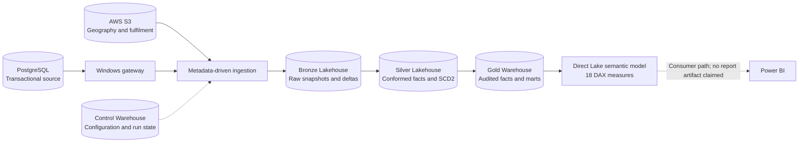

# Multi-Cloud Retail Order Intelligence Platform

**Microsoft Fabric | PostgreSQL | AWS S3 | PySpark | Delta Lake | Terraform | GitHub Actions**

A retail analytics engineering portfolio built around a 15-million-line
transactional workload. It combines metadata-driven ingestion, historical
dimensions, quality-gated Warehouse publishing and a Direct Lake semantic model.

> **Status, 7 October 2026:** source code and recorded verification evidence are
> available. The legacy analytics workspace has a recorded Gold publication of
> 15,001,016 sales lines. Dev/Test delivery has recorded acceptance results.
> The new Production workspace has four empty foundation containers; migration
> and three data-correctness findings remain open. This is not a production SLA
> or a claim of commercial adoption. See [implementation status](docs/implementation-status.md).

## Start Here

- [Architecture and flow diagrams](docs/architecture.md)
- [Walkthrough: source data to reporting](docs/project-walkthrough.md)
- [Measures, reporting marts and limitations](docs/metrics.md)
- [Safe local setup and source simulation](docs/getting-started.md)
- [CI/CD and infrastructure ownership](docs/delivery.md)
- [Documentation index](docs/README.md)

## Data Flow



## Engineering Decisions

| Problem | Implementation |
| --- | --- |
| Repeated source-specific ingestion | Metadata configuration, parent/child pipelines and separate control state |
| Frequent transactional updates | PostgreSQL watermark-based extraction using `dwh_load_ts` |
| Slowly changing references | S3 full-file snapshots with lineage, not row-level CDC |
| Historical attribute changes | PySpark/Delta SCD Type 2 dimensions and time-aware fact matching |
| Dirty and late data | Validation, rejection handling, deduplication and controlled test inputs |
| Failed reporting refresh | Candidate Gold build, audit gate and rollback-capable publication |
| Inconsistent report totals | Warehouse audit versus semantic-model reconciliation |
| Uncontrolled releases | Versioned definitions, migrations, Dev/Test validation and gated promotion |

A unit test is not a cloud integration test, and a passing fixture is not proof
of every replay or failure case. Open findings are documented, not hidden.

## Repository Map

```text
workspace/                  Native deployable Fabric items and TMDL
fabric/control_warehouse/   Control-plane SQL reference and bootstrap scripts
fabric/gold_warehouse/      Gold SQL and metric audit definitions
fabric/notebooks/src/       Readable sources; workspace/ is release authority
postgres/                   Owned source setup, staging, seed and order-header SQL
scripts/                    Source generators, validators and publication checks
migrations/                 Versioned deployment migrations
deploy/                     Release, migration and smoke-test tooling
infra/                      Fabric, identity and private S3 Terraform state setup
config/                     Environment bindings and disabled Production gates
tests/                      Credential-free definition and contract tests
.github/                    CI and explicitly dispatched release workflows
docs/                       Architecture, runbooks, status and editable diagram
```

Seed CSVs, generated datasets, private evidence, credentials, Terraform state
and personal documents are intentionally excluded. See [security](SECURITY.md).

## Validate Without Cloud Access

```bash
python -m venv .venv
source .venv/bin/activate
python -m pip install -r requirements.txt
python deploy/check_repository.py
python scripts/check_publication.py
pytest -q
```

Warehouse SQL tooling uses ODBC Driver 18. Spark/Delta transformations execute
in Fabric, not this local validation environment. These commands do not ingest,
deploy, reset watermarks or enable schedules.

## Delivery

Terraform manages stable infrastructure. GitHub Actions plus `fabric-cicd`/REST
publishes definitions. Fabric runs data processing. Git does not contain or
migrate Lakehouse/Warehouse business data. Production releases remain fail-closed.

The implementation is reviewed in [PR #1](https://github.com/dimpupraharsh/fabric-data-platform/pull/1).
Do not bypass its outstanding checks or reviews. See [contributing](CONTRIBUTING.md),
[release runbook](docs/release-runbook.md) and [Production cutover](docs/production-workspace-cutover.md).

## Licence

Code uses the [MIT licence](LICENSE). Third-party seed datasets are not
redistributed; their licensing must be checked independently.
