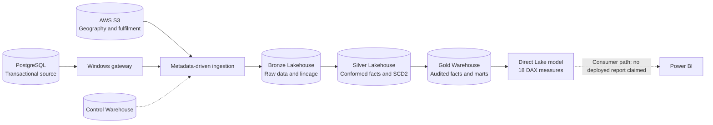

# Multi-Cloud Retail Order Intelligence Platform

**Microsoft Fabric | PostgreSQL | AWS S3 | PySpark | Delta Lake | Terraform | GitHub Actions**

A retail analytics engineering platform developed at SaleFisher under a Data Engineer
contract around a 15-million-line
transactional workload, with metadata-driven ingestion, historical dimensions,
audited Gold publication and a Direct Lake semantic model.

## Explore the Project

**[Browse the complete implementation](https://github.com/dimpupraharsh/fabric-data-platform/tree/setup/enterprise-fabric-cicd)**

The default branch hosts the project overview and documentation. Application
definitions and delivery tooling remain on the implementation branch while
[PR #1](https://github.com/dimpupraharsh/fabric-data-platform/pull/1) addresses
its outstanding correctness/release gates. Documentation publication is not a
Production deployment and does not bypass that review.

| Start here | What you will find |
| --- | --- |
| [Architecture](docs/architecture.md) | Data flow, metadata control and CI/CD diagrams |
| [Walkthrough](docs/project-walkthrough.md) | How source records become analytical datasets |
| [Metrics](docs/metrics.md) | 18 DAX measures, 11 Gold marts and their limitations |
| [Implementation status](docs/implementation-status.md) | Recorded results versus remaining work |
| [Setup guide](docs/getting-started.md) | Safe source tools and credential handling |
| [Debugging](docs/debugging.md) | Trace failures from source to semantic serving |
| [Documentation index](docs/README.md) | Runbooks, delivery, cutover and editable draw.io diagram |

## Source to Reporting

## Key Engineering Patterns

- PostgreSQL watermark-based incremental ingestion and S3 full-file snapshots.
- Metadata-driven parent/child pipelines with a separate control Warehouse.
- PySpark/Delta deduplication, SCD Type 2 history and late-arrival processing.
- Candidate quality gates and transactional Gold publication.
- Explicit metric eligibility and Warehouse/model reconciliation.
- Terraform infrastructure and guarded GitHub Actions Dev/Test delivery.

## Evidence and Limitations

The recorded legacy Gold publication contains **15,001,016 sales lines** and
**5,007,874 orders**. This audit was published on 29 September 2026 and read on
3 October; it is not a fresh data count. Recorded Test acceptance includes
12 Silver checks and 10 Gold SQL stages, with explicit fixture limitations.

As reviewed for publication on **7 October 2026**, three data-correctness
findings remain open. The new Production workspace has four empty foundation
containers; legacy data are preserved pending verified migration and cutover.
No commercial adoption, cost savings, production SLA or deployed Power BI
report is claimed. See [status](docs/implementation-status.md).

## Implementation Layout

The [implementation branch](https://github.com/dimpupraharsh/fabric-data-platform/tree/setup/enterprise-fabric-cicd)
contains native Fabric items under `workspace/`, PostgreSQL setup under
`postgres/`, source tools under `scripts/`, control/Gold SQL under `fabric/`,
versioned migrations, Terraform, environment bindings, tests and delivery workflows.
Use its README for validation and execution instructions.

Private CSVs, generated datasets, source dumps, credentials, Terraform state,
runtime evidence and personal documents are intentionally excluded.
See [security](SECURITY.md). Code uses the [MIT licence](LICENSE); no third-party
seed data are redistributed.
