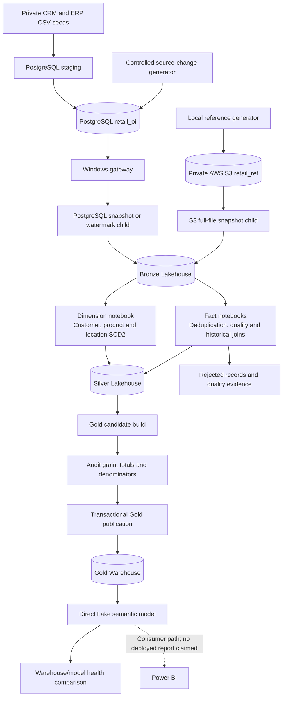
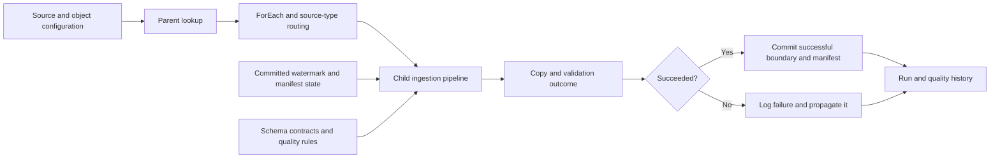
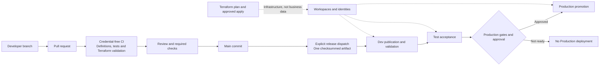

# Architecture

## Data Plane: Where Records Move

Bronze retains source shape and lineage. Silver owns cleansing, conformance,
history and late arrivals. Gold owns analytical facts and marts. S3 enriches
transactions; it does not duplicate the sales fact.

## Control Plane: What Tells Pipelines What to Do

This is the control contract, not universal exactly-once proof. Open findings
concern overlapping arrivals, DQ classification transitions and independently
arriving reference snapshots. Runtime state stays in the control Warehouse,
never in Terraform or Git.

## Delivery Plane: How Code Reaches Fabric

GitHub Actions is the documented application promotion authority. The native
Fabric deployment pipeline is a stage/comparison surface; do not release the
same items independently through both mechanisms.

| Component | Execution location |
| --- | --- |
| Source generators | Local operator; writes only the owned project source |
| Gateway | Windows VM; network bridge, not transformation compute |
| Pipelines | Fabric orchestration and Copy |
| PySpark/Delta notebooks | Fabric Spark |
| Gold SQL | Fabric Warehouse |
| DAX | Semantic model |
| CI | GitHub runner without cloud credentials |
| Release/Terraform tools | Authorized runner/operator with explicit execution |

Business-data backup, replay and migration are separate from Git and item deployment.
