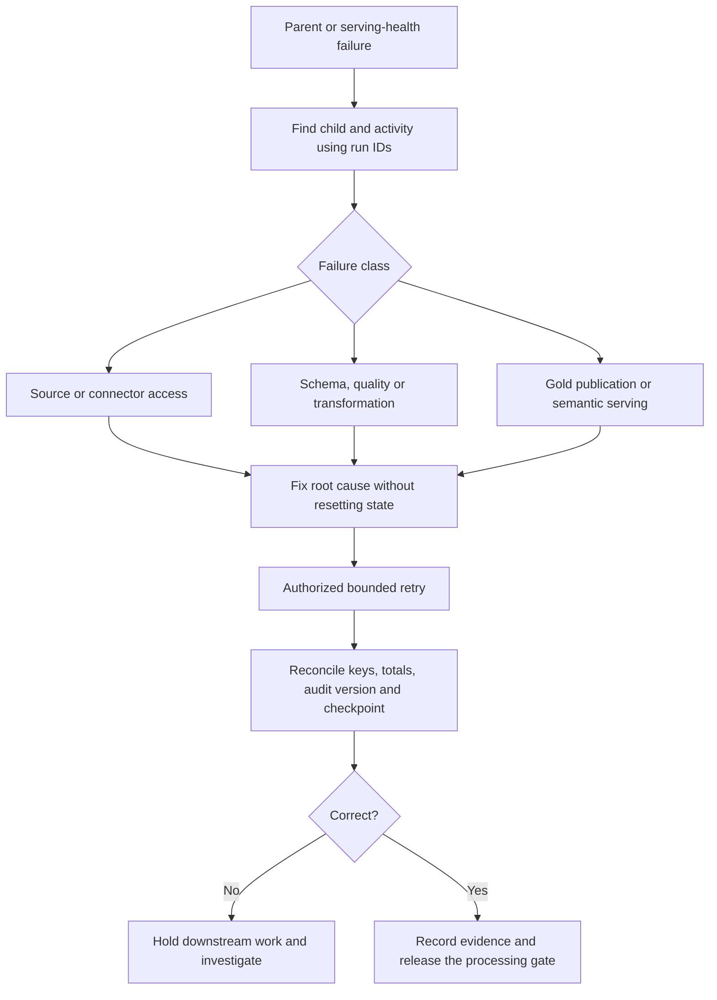

# Debug a Failed Processing Run

## Trace the Failure, Not Just the Parent Status

1. Record environment, parent run ID, child run ID, source object and failed activity.
2. Inspect the child's error and control run logs; do not advance/reset a checkpoint.
3. Identify whether the failure is connectivity, extraction, schema, quality,
   transformation, publication or semantic serving.
4. Compare the last committed boundary/manifest with the attempted input batch.
5. Repair the cause, then perform an authorized bounded retry with reconciliation.

| Symptom | First checks |
| --- | --- |
| PostgreSQL unreachable | Container, gateway VM/service, private routing, port/authentication |
| S3 denied | Caller identity, exact bucket/prefix permissions and connector binding |
| Unexpected full scan | Object strategy, watermark type/bounds and source predicate |
| Schema rejection | Observed schema versus contract; decide compatible evolution or breaking change |
| Missing dimension match | Business key, event date, SCD2 validity and reference version |
| Duplicate/missing fact | Source key, committed input set, retry and classification transitions |
| Gold audit fails | Grain, unique keys, eligible population and mart reconciliation |
| Report/model stale | Published audit version, semantic binding/access and health comparison |

## Important Safeguards

- Successful cleanup must not hide failed business processing.
- A failed Bronze/Silver stage must not allow downstream Gold to run.
- Never delete rejects to make a quality gate green; reconcile transitions by key.
- Do not treat completion time as a safe arrival boundary without committed-input semantics.
- Do not reschedule multiple parents against shared runtime state.
- Local tests and fixture replay are useful, but do not prove physical Copy recovery.

Known exceptions are in [readiness blockers](production-readiness-blockers.md).
Do not silently convert them into completed guarantees in documentation.
